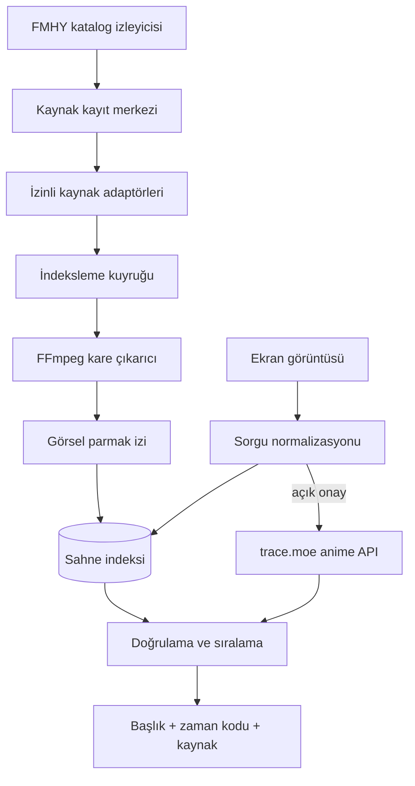
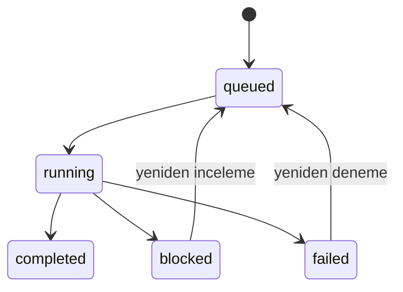

# Sahne Avcısı mimarisi

## Hedef

Kullanıcının yüklediği tek bir ekran görüntüsünü veya kısa video kesitini, önceden indekslenmiş video kareleriyle eşleştirerek içerik adı, bölüm, zaman kodu ve güvenli kaynak bağlantısı döndürmek.

## Bileşenler



### Kaynak kayıt merkezi

FMHY ve elle tanımlanan kaynaklar tek bir kayıt modeline dönüştürülür. Yeni keşfedilen siteler doğrudan indekslenmez; inceleme kuyruğuna girer.

Her FMHY taraması ayrı bir `catalog_sync_runs` kaydıdır. Bir kaynağın katalog üyeliği `catalog_memberships`, değişiklik geçmişi ise `source_events` içinde tutulur. Böylece alan adı veya açıklaması değişen, geçici olarak kaybolan ve sonradan geri gelen kaynaklar ayırt edilir.

Kaynak durumları:

- `active`: katalog olarak güvenli biçimde kullanılabilir.
- `adapter-required`: kaynak için teknik adaptör gerekir.
- `review-required`: teknik/hukuki/güvenlik incelemesi gerekir.
- `legal-review`: kullanım hakkı açıklığa kavuşmadan işlenmez.
- `disabled`: kapalı veya bilinçli olarak devre dışı.

FMHY yıldızlı kaynakları, oynatıcı türleri, 4K/otomatik oynatma gibi özellikler etiketlenir. İndirme, torrent, canlı TV, Smart TV/uygulama listeleri, durum sayfası ve yardımcı dokümantasyon bağlantıları adaptör kuyruğuna alınmaz. İzleme/veritabanı bölümleri `metadata` türüyle kaydedilir; `enqueue_index_job` bu türü zaten reddeder.

Durum alanı yalnızca operatöre aittir: katalog eşitlemesi yeni kaynağı `review-required` ile oluşturur, ancak var olan bir kaydın durumunu güncellemez. Böylece tekrarlanan eşitlemeler elle verilmiş `active`/`disabled` kararlarını geri almaz.

### Akıştan indeksleme

Bir uzun metrajlı film birkaç yüz megabayt, ama geriye bıraktığı parmak izi
birkaç yüz kilobayt. Filmi önce diske yazmak bu oranı ters çeviriyor ve küçük
bir sunucuda aynı anda kaç iş koşabileceğini diskin belirlemesine yol açıyordu.

Worker artık gövdeyi kendi doğrulanmış HTTP istemcisinden okuyup doğrudan
FFmpeg'in `stdin`'ine besliyor. Aktarım bizim istemcimizde kaldığı için HTTPS,
yönlendirme, özel IP ve boyut kontrolleri aynen geçerli: FFmpeg kendi soketini
hiç açmıyor. Bu, adrese doğrudan FFmpeg'i bakmaktan farkı olan asıl noktadır.

Ölçülen (Archive.org'dan 25 MB'lık bir film): indir-sonra-işle 14,5 sn ve
25 MB disk; akış 5,8 sn ve 0 MB. Çıkan kareler ve arama sonuçları birebir aynı.

Boru aranamadığı için iki şey değişir: süre bilgisi `ffprobe` yerine katalog
metadatasından gelir (`AdapterResult.duration_ms`), ve dizinini dosya sonunda
tutan kapsayıcılar çözülemez. İkinci durumda `StreamingUnsupportedError`
fırlatılır ve worker eski indirme yoluna düşer. HLS aynalaması akışa girmez;
kendi yolunda kalır.

### Eşzamanlı indeksleme

İş kapma zaten yarışmasızdı: `claim_index_job` `BEGIN IMMEDIATE` ile yazma
kilidini alır ve `status='queued'` koşullu `UPDATE`'in `rowcount`'unu kontrol
eder, yani iki worker aynı işi alamaz. Eşzamanlılığı açmak için gereken diğer
iki parça eklendi.

`HostLimiter` tek bir alan adına aynı anda açılacak aktarım sayısını sınırlar.
Eşzamanlılık bizim verimimiz için; çektiğimiz kataloğun bunu hissetmemesi
gerekir. Toplu içe aktarmada işlerin neredeyse tamamı aynı siteye gittiği için
pratikte hızı belirleyen sayı da budur.

SQLite bağlantılarında `busy_timeout` 30 saniyeye çıkarıldı. Python'ın
varsayılanı 5 saniyedir; tek bir işin binlerce kare yazması bunu aşabilir ve
diğer worker'a "database is locked" döndürebilir.

Ölçülen (6 kısa film, 4 çekirdek): sıralı 34,9 sn, `--concurrency 4
--per-host 4` ile 16,2 sn. Hızlanma doğrusal değil; nezaket sınırı bilerek
bağlayıcı kısıt bırakıldı ve kare çıkarma CPU'ya bağlı.

### Internet Archive adaptörü

`archive-org` türündeki kaynak, oynatıcı sayfası kazımak yerine Archive'ın
belgelenmiş `archive.org/metadata/<id>` API'sini kullanır: öğe kimliği URL'den
çıkarılır, dosya listesinden en uygun video rendition'ı seçilir ve
`archive.org/download/...` adresi doğrudan indirme hedefi olur.

Adaptör iki kapı uygular. Öğenin `mediatype` alanı `movies` değilse reddedilir.
Lisans alanı (`licenseurl`/`license`/`rights`) kamu malı veya Creative Commons
göstermiyorsa da reddedilir — eksik lisans izin sayılmaz. Her iki durumda da iş
`failed` değil `blocked` olur, çünkü bu öğenin kalıcı bir özelliğidir, geçici bir
aktarım hatası değil.

Boyut tavanı worker'ın `max_video_bytes` değerinden gelir; adaptör dosya seçimini
buna göre daraltır, indirme koruması ayrıca yeniden doğrular.

### Kaynak adaptörü sözleşmesi

`AdapterRegistry`, etkin bir kaynağın kendi alan adındaki sayfayı çözer ve standart oynatıcı işaretlerini ortak bir sonuca dönüştürür:

```python
class AdapterResult:
    adapter: str
    page_url: str
    title: str
    media_url: str | None
    player_type: str
    indexable: bool
```

Genel adaptör doğrudan video, Open Graph video ve HTML5 `video/source` elemanlarını indeksleyebilir. Açık HLS VOD manifestleri güvenli yerel aynaya alınarak indekslenir; iframe oynatıcılar yalnızca tespit edilir ve `blocked` durumuna alınır. Adaptör DRM, oturum, ödeme duvarı, CAPTCHA veya başka bir erişim kontrolünü aşmamalıdır.

### HLS güvenli aynası

`HlsMirror`, ana manifestten hedefe en yakın 480p varyantı seçer ve medya manifestini ayrıştırır. Yalnızca `#EXT-X-ENDLIST` içeren tamamlanmış VOD akışları kabul edilir. Canlı/düşük gecikmeli akışlar, şifre anahtarları, desteklenmeyen URI etiketleri, aşırı süre/parça sayısı ve manifest güven alanı dışındaki parçalar reddedilir.

Manifest ve parçalar geçici dizine yerel adlarla yazılır; uzak URL'ler yeniden yazılan manifestte bulunmaz. FFprobe ve FFmpeg HLS girdisinde `file,data` protokol izin listesiyle çalışır. Böylece ayrıştırıcıya ulaşabilecek bir uzak URI ikinci bir ağ isteği başlatamaz.

### İndeksleme işleri

`index_jobs` tablosu URL başına kalıcı görev ve şu yaşam döngüsünü tutar:



API yalnızca yönetici anahtarıyla iş oluşturur. Worker görevi atomik olarak sahiplenir, videoyu boyut sınırlı geçici dosyaya indirir, FFmpeg ile indeksler ve geçici dosyayı siler. Birden fazla worker aynı işi eşzamanlı alamaz.

### Sahne indeksleme

MVP her iki saniyede bir kare örnekler ve iki 64 bit parmak izi tutar. Üretim sürümünde:

1. PySceneDetect/FFmpeg ile sahne değişimleri belirlenir.
2. Her sahneden temsilî kareler alınır.
3. pHash/dHash ile birebir ve yakın kopya katmanı oluşturulur.
4. OpenCLIP veya SigLIP embedding üretilir.
5. PostgreSQL `pgvector` ya da Qdrant ile yaklaşık en yakın komşu araması yapılır.
6. En iyi adaylar OpenCV yerel özellik eşleşmesiyle yeniden sıralanır.

Video dosyaları kalıcı olarak saklanmaz. Gerekli minimum parmak izi, zaman kodu ve kaynak metadatası tutulur.

### Sorgu işlemi

1. EXIF yönü düzeltilir.
2. Siyah sinema kenarları azaltılır.
3. İleride altyazı, filigran ve oynatıcı kontrolleri maskelenir.
4. Hash ve embedding oluşturulur.
5. Yetişkin filtresi sorgu sahibinin açık onayına göre uygulanır.
6. Aday sonuçlar kaynak sağlığı ve benzerlik puanıyla sıralanır.

### trace.moe federasyonu

Anime dış araması varsayılan kapalıdır. `use_trace_moe=true` yalnızca kullanıcı arayüzündeki açık onaydan sonra gönderilir ve `all` veya `anime` kategorilerinde çalışır. Sunucu doğrulanmış görsel baytlarını `POST /search?anilistInfo&cutBorders=2` isteğiyle yollar; isteğe bağlı anahtar `x-trace-key` başlığına eklenir.

Dönen sonuçlar yerel sonuç modeliyle birleştirilir. AniList başlığı, bölüm, zaman kodu ve benzerlik korunur; önizleme adresleri yalnızca `trace.moe` HTTPS alan adları için kabul edilir. `isAdult` sonuçları 18+ onayı yoksa sunucuda elenir. Dış servis hatası yerel aramayı başarısız yapmaz.

## Ölçekleme planı

## Arama performansı

Hash'ler `frames` tablosunda 64-bit `INTEGER` olarak saklanır ve bellekte
bitişik `uint64` dizileri hâlinde tutulur; puanlama numpy ile vektörleştirilmiş
tek bir XOR + popcount geçişidir. Önbellek, kare sayısı veya en büyük kare
kimliği değiştiğinde yeniden kurulur.

Daha önce hash'ler `TEXT` idi ve her karşılaştırmada hex parse ediliyordu; bu,
arama süresinin neredeyse tamamını oluşturuyordu. 200 bin karede ölçülen fark:

| Yaklaşım | Arama | Kalıcı RAM |
|---|---|---|
| Hex metin, satır satır puanlama | 5.092 ms | — |
| INTEGER + numpy vektör | **1,92 ms** | 51 bayt/kare |

Bu ölçekte tarama O(n) kalır ama bellek bant genişliğinde çalışır: 20,7 milyon
kare (tüm kamu malı arşivi) yaklaşık 199 ms ve 830 MB'a denk gelir.

LSH veya BK-tree denenmedi çünkü varsayılan eşik olan 0,55 benzerlik 128 bitte
57 bitlik farka izin verir; bu mesafede güvercin yuvası prensibi tutmaz ve
hiçbir bucket şeması aday sayısını anlamlı biçimde azaltmaz. Eşik belirgin
şekilde sıkılaştırılırsa bu yapılar yeniden gündeme gelebilir.

Bundan sonraki ölçek adımı için:

- Metadata: PostgreSQL
- Vektörler: pgvector veya Qdrant
- İş kuyruğu: Redis Streams veya RabbitMQ
- Kare işleme: bağımsız Python worker havuzu
- API: ASP.NET Core veya Python ASGI
- Nesne saklama: yalnızca geçici işlem dosyaları için S3 uyumlu depo
- Gözlemlenebilirlik: OpenTelemetry

İçerik kopyaları video ve ses parmak izleriyle tek medya kaydında birleştirilir; farklı kaynak URL’leri aynı kayda bağlanır.

## FMHY-first stratejisi

FMHY video kaynağı değil, değişen kaynakları keşfetmek için ana katalogdur. Sistem FMHY sayfalarını belirli aralıklarla karşılaştırır:

- Yeni bağlantı → `review-required`
- Değişen alan adı → mevcut kaynağın alternatifi
- Kaldırılan bağlantı → sağlık kontrolü ve pasifleştirme adayı
- Bilinen oynatıcı altyapısı → uygun adaptör adayı
- İndirme/torrent kaynağı → sahne indeksleme dışında tutulur

Bu sayede yüzlerce site tek tek sabit kodlanmak yerine kaynak ve oynatıcı aileleri üzerinden yönetilir.
