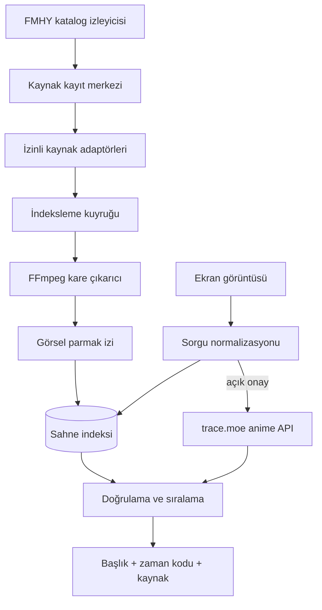
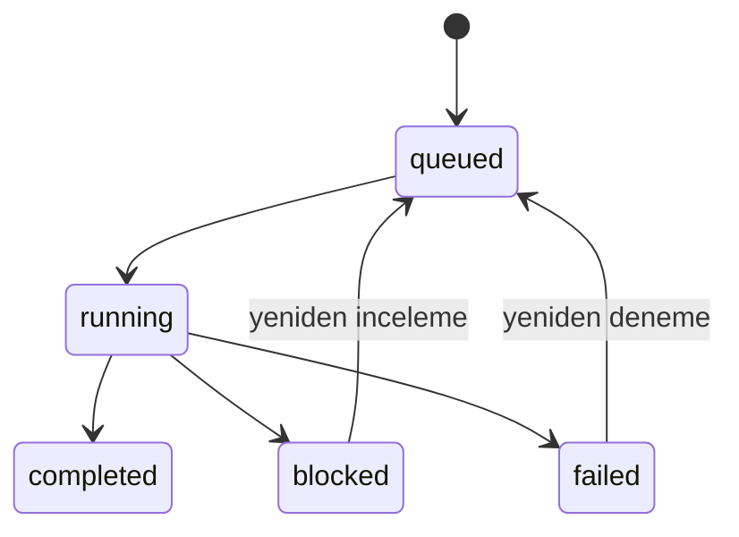

# Sahne Avcısı mimarisi

## Hedef

Kullanıcının yüklediği tek bir ekran görüntüsünü veya kısa video kesitini, önceden indekslenmiş video kareleriyle eşleştirerek içerik adı, bölüm, zaman kodu ve güvenli kaynak bağlantısı döndürmek.

## Bileşenler



### Kaynak kayıt merkezi

FMHY ve elle tanımlanan kaynaklar tek bir kayıt modeline dönüştürülür. Yeni keşfedilen siteler doğrudan indekslenmez; inceleme kuyruğuna girer.

Her FMHY taraması ayrı bir `catalog_sync_runs` kaydıdır. Bir kaynağın katalog üyeliği `catalog_memberships`, değişiklik geçmişi ise `source_events` içinde tutulur. Böylece alan adı veya açıklaması değişen, geçici olarak kaybolan ve sonradan geri gelen kaynaklar ayırt edilir.

Kaynak durumları:

- `active`: katalog olarak güvenli biçimde kullanılabilir.
- `adapter-required`: kaynak için teknik adaptör gerekir.
- `review-required`: teknik/hukuki/güvenlik incelemesi gerekir.
- `legal-review`: kullanım hakkı açıklığa kavuşmadan işlenmez.
- `disabled`: kapalı veya bilinçli olarak devre dışı.

FMHY yıldızlı kaynakları, oynatıcı türleri, 4K/otomatik oynatma gibi özellikler etiketlenir. İndirme, torrent, canlı TV, durum sayfası ve yardımcı dokümantasyon bağlantıları adaptör kuyruğuna alınmaz.

### Kaynak adaptörü sözleşmesi

`AdapterRegistry`, etkin bir kaynağın kendi alan adındaki sayfayı çözer ve standart oynatıcı işaretlerini ortak bir sonuca dönüştürür:

```python
class AdapterResult:
    adapter: str
    page_url: str
    title: str
    media_url: str | None
    player_type: str
    indexable: bool
```

Genel adaptör doğrudan video, Open Graph video ve HTML5 `video/source` elemanlarını indeksleyebilir. HLS ile iframe oynatıcılar yalnızca tespit edilir ve `blocked` durumuna alınır; otomatik takip edilmez. Adaptör DRM, oturum, ödeme duvarı, CAPTCHA veya başka bir erişim kontrolünü aşmamalıdır.

### İndeksleme işleri

`index_jobs` tablosu URL başına kalıcı görev ve şu yaşam döngüsünü tutar:



API yalnızca yönetici anahtarıyla iş oluşturur. Worker görevi atomik olarak sahiplenir, videoyu boyut sınırlı geçici dosyaya indirir, FFmpeg ile indeksler ve geçici dosyayı siler. Birden fazla worker aynı işi eşzamanlı alamaz.

### Sahne indeksleme

MVP her iki saniyede bir kare örnekler ve iki 64 bit parmak izi tutar. Üretim sürümünde:

1. PySceneDetect/FFmpeg ile sahne değişimleri belirlenir.
2. Her sahneden temsilî kareler alınır.
3. pHash/dHash ile birebir ve yakın kopya katmanı oluşturulur.
4. OpenCLIP veya SigLIP embedding üretilir.
5. PostgreSQL `pgvector` ya da Qdrant ile yaklaşık en yakın komşu araması yapılır.
6. En iyi adaylar OpenCV yerel özellik eşleşmesiyle yeniden sıralanır.

Video dosyaları kalıcı olarak saklanmaz. Gerekli minimum parmak izi, zaman kodu ve kaynak metadatası tutulur.

### Sorgu işlemi

1. EXIF yönü düzeltilir.
2. Siyah sinema kenarları azaltılır.
3. İleride altyazı, filigran ve oynatıcı kontrolleri maskelenir.
4. Hash ve embedding oluşturulur.
5. Yetişkin filtresi sorgu sahibinin açık onayına göre uygulanır.
6. Aday sonuçlar kaynak sağlığı ve benzerlik puanıyla sıralanır.

### trace.moe federasyonu

Anime dış araması varsayılan kapalıdır. `use_trace_moe=true` yalnızca kullanıcı arayüzündeki açık onaydan sonra gönderilir ve `all` veya `anime` kategorilerinde çalışır. Sunucu doğrulanmış görsel baytlarını `POST /search?anilistInfo&cutBorders=2` isteğiyle yollar; isteğe bağlı anahtar `x-trace-key` başlığına eklenir.

Dönen sonuçlar yerel sonuç modeliyle birleştirilir. AniList başlığı, bölüm, zaman kodu ve benzerlik korunur; önizleme adresleri yalnızca `trace.moe` HTTPS alan adları için kabul edilir. `isAdult` sonuçları 18+ onayı yoksa sunucuda elenir. Dış servis hatası yerel aramayı başarısız yapmaz.

## Ölçekleme planı

MVP SQLite üzerinde bütün kareleri uygulama belleğinde puanlar. Büyük katalog için bu yaklaşım değiştirilmelidir:

- Metadata: PostgreSQL
- Vektörler: pgvector veya Qdrant
- İş kuyruğu: Redis Streams veya RabbitMQ
- Kare işleme: bağımsız Python worker havuzu
- API: ASP.NET Core veya Python ASGI
- Nesne saklama: yalnızca geçici işlem dosyaları için S3 uyumlu depo
- Gözlemlenebilirlik: OpenTelemetry

İçerik kopyaları video ve ses parmak izleriyle tek medya kaydında birleştirilir; farklı kaynak URL’leri aynı kayda bağlanır.

## FMHY-first stratejisi

FMHY video kaynağı değil, değişen kaynakları keşfetmek için ana katalogdur. Sistem FMHY sayfalarını belirli aralıklarla karşılaştırır:

- Yeni bağlantı → `review-required`
- Değişen alan adı → mevcut kaynağın alternatifi
- Kaldırılan bağlantı → sağlık kontrolü ve pasifleştirme adayı
- Bilinen oynatıcı altyapısı → uygun adaptör adayı
- İndirme/torrent kaynağı → sahne indeksleme dışında tutulur

Bu sayede yüzlerce site tek tek sabit kodlanmak yerine kaynak ve oynatıcı aileleri üzerinden yönetilir.
